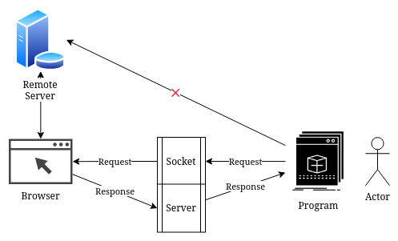

# Browser Hook

Execute requests from your script, via the browser. It is useful for testing and debugging.

It might not be the best solution, but works well enough.

## Usage

1. Copy the script from `hook.js` and paste it into your browser's console.
2. Start the `server.js` script.
3. Execute your script.
4. Send request to `/send/:data` where `:data` is a base64 encoded string of a JSON object.

You can also use the `run.py` script to test this out.
